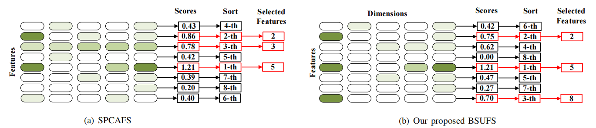

# BSUFS

The code in this toolbox implements "Bi-Sparse Unsupervised Feature Selection" by <i>X. Xiu, C. Huang, P. Shang, W. Liu</i>.

### Testing
Directly run demo.m for reproduction.

### Citation
Please give credits to this paper if this code is useful and helpful for your research.

     @article{xiu2025bi,
      title     = {Bi-Sparse Unsupervised Feature Selection}, 
      author    = {Xiu, Xianchao and Huang, Chenyi and Shang, Pan and Liu, Wanquan},
      journal   = {IEEE Transactions on Image Processing}, 
      year      = {2025},
      volume    = {34},
      number    = {},
      pages     = {7407--7421},
      publisher = {IEEE}
     }

